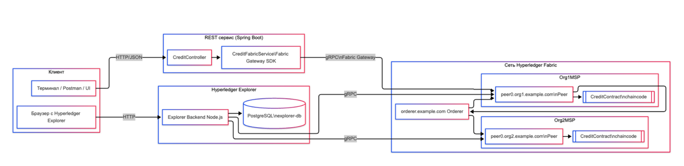

# Разработка смарт контракта для кредитного протокола на основе блокчейна

- В прототите развернута сеть Hyperledger Fabric с двумя организациями `Org1 и Org2`
- Ордерер `orderer.example.com` отвечает за упорядочивание транзакций и формирование блоков.
- Узлы `peer0.org1.example.com` и `peer0.org2.example.com` хранят реестр, выполняют смарт-контракт `CreditContract` и подписывают результаты транзакций
- Контейнеры `ca_org1, ca_org2 и ca_orderer` — это центры сертификации, которые выдают криптографические материалы для всех участников сети
- Отдельные dev-контейнеры `chaincode` содержат реализацию кредитного протокола на Java и используются peer-узлами для выполнения бизнес-логики»



## 1. Создание аккаунтов
### 1.1. Создать acc3 (Charlie)
```bash
   curl -v -X POST http://localhost:8081/api/accounts \
   -H "Content-Type: application/json" \
   -d '{"id":"acc3","owner":"Charlie","balance":0}'
```

### 1.2. Создать acc4 (Diana)

```bash
curl -v -X POST http://localhost:8081/api/accounts \
-H "Content-Type: application/json" \
-d '{"id":"acc4","owner":"Diana","balance":0}'
```
## 2. Прочитать аккаунты
###   2.1. Посмотреть acc1
```bash
   curl -v http://localhost:8081/api/accounts/acc1
```
### 2.2. Посмотреть новенькие acc3 и acc4
```bash
curl -v http://localhost:8081/api/accounts/acc3
curl -v http://localhost:8081/api/accounts/acc4
```

## 3. Депозит на счёт

Например, пополним acc3 на 1000:

```bash
curl -v -X POST http://localhost:8081/api/accounts/acc3/deposit \
-H "Content-Type: application/json" \
-d '{"amount":1000}'
```

Проверяем баланс:

```bash
curl -v http://localhost:8081/api/accounts/acc3
```

## 4. Выдача кредита

Допустим, выдаём кредит loan1 на счёт acc3 на 500:

```bash
curl -v -X POST http://localhost:8081/api/loans \
-H "Content-Type: application/json" \
-d '{"id":"loan1","accountId":"acc3","principal":500,"outstanding":0,"status":"ACTIVE"}'
```

Посмотреть кредит:

```bash
curl -v http://localhost:8081/api/loans/loan1
```

## 5. Погашение кредита

Погасим часть кредита loan1, скажем 200:

```bash
curl -v -X POST http://localhost:8081/api/loans/loan1/repay \
-H "Content-Type: application/json" \
-d '{"amount":200}'
```

Проверяем:

```bash
curl -v http://localhost:8081/api/loans/loan1
```
И заодно состояние счёта acc3:

```bash
curl -v http://localhost:8081/api/accounts/acc3
```

## 6. Перевод между счетами

Сделаем перевод, например, 150 с acc3 на acc4:

```bash
curl -v -X POST http://localhost:8081/api/transfers \
-H "Content-Type: application/json" \
-d '{"fromId":"acc3","toId":"acc4","amount":150}'
```

После этого:

```bash
curl -v http://localhost:8081/api/accounts/acc3
curl -v http://localhost:8081/api/accounts/acc4
```

## 7. Примеры «негативных» тестов (можно показать на защите)
###    7.1. Повторное создание уже существующего аккаунта
```bash
curl -v -X POST http://localhost:8081/api/accounts \
   -H "Content-Type: application/json" \
   -d '{"id":"acc3","owner":"Charlie","balance":0}'
````

Ожидаешь 400 и текст ошибки от контракта (что аккаунт уже есть).

### 7.2. Кредит без `accountId` (проверка валидации)
```bash
curl -v -X POST http://localhost:8081/api/loans \
-H "Content-Type: application/json" \
-d '{"id":"loan2","principal":300}'
```

----


### 1. `orderer.example.com`

**Роль: "центральный диспетчер блоков"**

- принимает подтверждённые (endorsed) транзакции от пиров
- cортирует их в правильном порядке
- пакует в блоки и рассылает всем peer’ам в канале (mychannel)
- обеспечивает тот же порядок транзакций для всех участников сети

> Orderer - не выполняет смарт-контракты, а только сортирует и доставляет блоки всем организациям

### 2. `peer0.org1.example.com` и `peer0.org2.example.com`

**Роль: узлы-участники (банковские ноды)**

Каждый peer делает три вещи:

1. хранит ledger (блокчейн + world state):
- его локальная копия цепочки блоков,
- текущее состояние (балансы, кредиты и т.п.).

2. Выполняет chaincode (смарт-контракт):

- при запросе endorse’а запускает наш CreditContract,
- проверяет, как изменится состояние

3. подписывает результат (endorsement):

- если всё ок, подписывает ответ и отдаёт клиенту (SDK / peer CLI)

Отличия между ними:

- `peer0.org1.example.com` — узел Org1 (например, “Банк А”).
- `peer0.org2.example.com` — узел Org2 (“Банк Б”).

### 3. `ca_org1, ca_org2, ca_orderer`

**Роль: "центры сертификации (выдают паспорта участникам)"**

Это Fabric CA — отдельные сервисы, которые:

генерят ключи и сертификаты для:

- админов организаций (`admin@org1.example.com`),
- пиров и ордереров,
- клиентов/пользователей

Обслуживают операции:

- регистрация (`register`),
- выдача сертификатов (`enroll`)

Конкретно:

`ca_org1` - CA для Org1 выдаёт материалы для `peer0.org1` и админов Org1
`ca_org2` - CA для Org2
`сa_orderer` - CA, который обслуживает `orderer.example.com`

Через них как раз и получаются те самые cert.pem, keystore/*.sk, которые мы вставили в Wallet для Java SDK.

### 4. dev-контейнеры chaincode - процессы со смарт-контрактом

физически код контракта крутится в отдельном контейнере, а peer ходит как к микросервису

В “старой” модели (lifecycle + external builder off) Fabric делает так:

- Для каждого пира, на котором установлен chaincode, поднимает отдельный Docker-контейнер с Java-chaincode.
- peer, когда симулирует транзакцию, общается с этим контейнером по gRPC

То есть:

`dev-peer0.org1.example.com-...` — это CreditContract (Java), который обслуживает вызовы от `peer0.org1`.
`dev-peer0.org2.example.com-...` — то же самое, но для peer0.org2.

Если эти dev-контейнеры не запущены, peer не сможет выполнить контракт и начнёт ругаться:

`could not launch chaincode ... connection to ... failed`

## Тестирование прототипа

```bash
for i in {1..50}; do \
  /usr/bin/time -f "%e" curl -s -X POST http://localhost:8081/api/loans \
    -H "Content-Type: application/json" \
    -d '{"id":"loanB'$i'","accountId":"acc3","principal":500,"outstanding":0,"status":"ACTIVE"}' \
    > /dev/null 2>> blockchain_times.txt
done
```